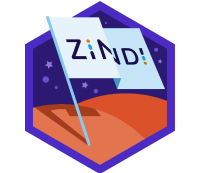

# <b>Hi there</b> 

## <b>Whoami? 🙃</b>

I am Emmanuel, a seasoned professional with a focus on application development and data science as a specialized subset. Proficient in Python, I excel in crafting dynamic and interactive web applications using frameworks. In the realm of data science, I bring a wealth of experience in collecting, cleaning, and analyzing complex datasets, leveraging statistical analysis and data mining techniques to discover valuable insights. My skills extend to creating data reports, interactive dashboards, and predictive models. This unique combination of web development and data science expertise allows me to deliver innovative solutions that drive success and empower organizations with data-driven insights.

## <b>What I am good at!/Skills 🧙🏼‍♂️</b>
<ul>
    <li>Web/Mobile Development</li>
    <li>Data Science, Data Analysis</li>
    <li>Machine learning Modeling</li>
</ul>

## <b>Tech Stack 🧰</b>
<ul>
        <li>
            
Languages:

            Python | JavaScript | C/C++ | HTML | CSS
        </li> 
        <li>
            
Frameworks & Tools:

            <b>Frameworks:</b> Django, SpringBoot, ReactJS, NextJs 
            <b>Data Science (ML/AI):</b> Scikit-learn, PyTorch 
            <b>Data Libraries:</b> NumPy, Pandas, Matplotlib, Plotly, Seaborn 
            <b>Databases:</b> SQLite, MySQL, PostgreSQL, MongoDB 
            <b>IoT:</b> NodeMCU, Arduino 
            <b>Cloud & Hosting:</b> Digital Ocean, Heroku, GoDaddy 
            <b>API Testing:</b> Postman 
            <b>Operating Systems:</b> Ubuntu, Kali, Windows 
            <b>Shells:</b> Zsh, Bash 
            <b>Version Control:</b> Git, GitHub, BitBucket 
            <b>Code Editors & Environments:</b> VSCode, Sublime, Vim, Nano
        </li>
    </ul>

## <b>Hobbies 🎭</b>
<ul>
    <li>Movies</li>
    <li>Music</li>
    <li>Adventures</li>
    <li>Playing Guitar</li>
    <li>Reading</li>
</ul>

## <b>How to reach me 📞</b>
<ul>
    <li>
        <a href="mailto:manueltylan@gmail.com">Email me => manueltylan(at)gmail.com</a>
    </li>
</ul>

## <b>Badges 📂</b>

<a href="https://zindi.africa/users/l3un6m" target="_blank">
    </img>
</a>
<a href="https://www.credly.com/badges/b8fca50e-3ec9-4999-84c8-55d54a6bf31e/public_url" target="_blank">
    </img>
</a>
 
